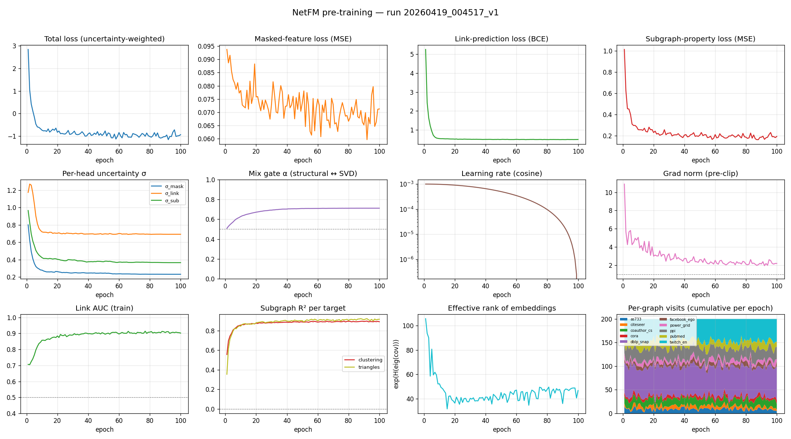
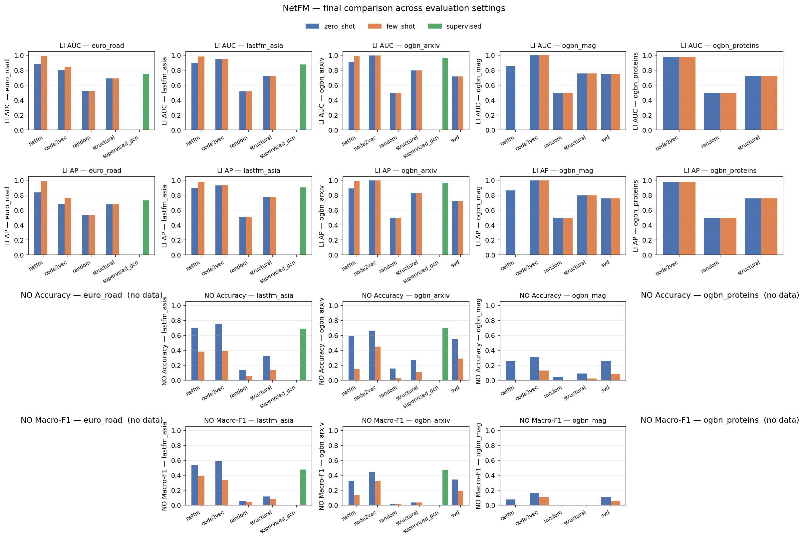
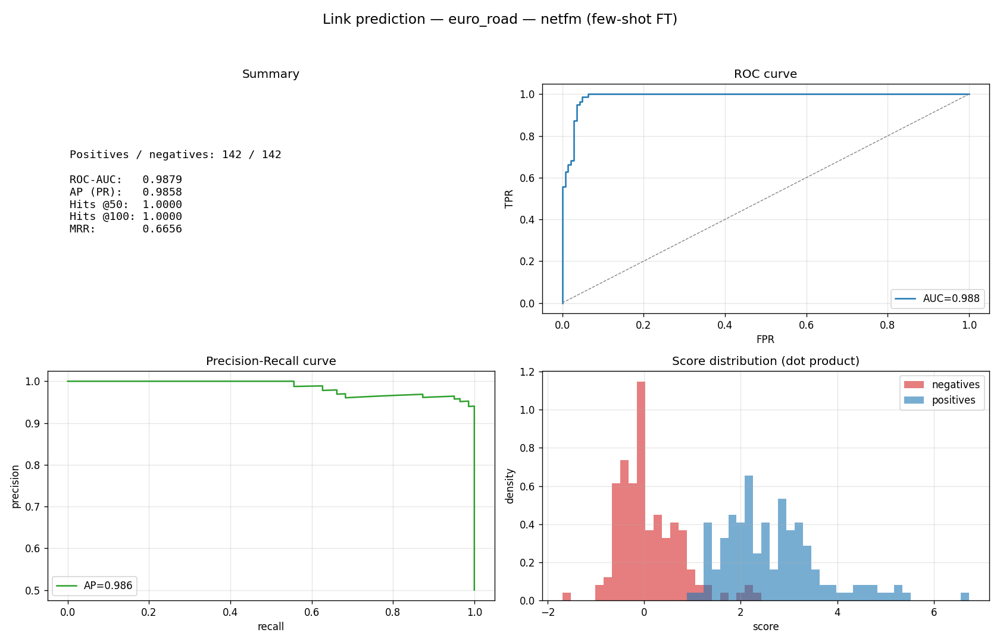
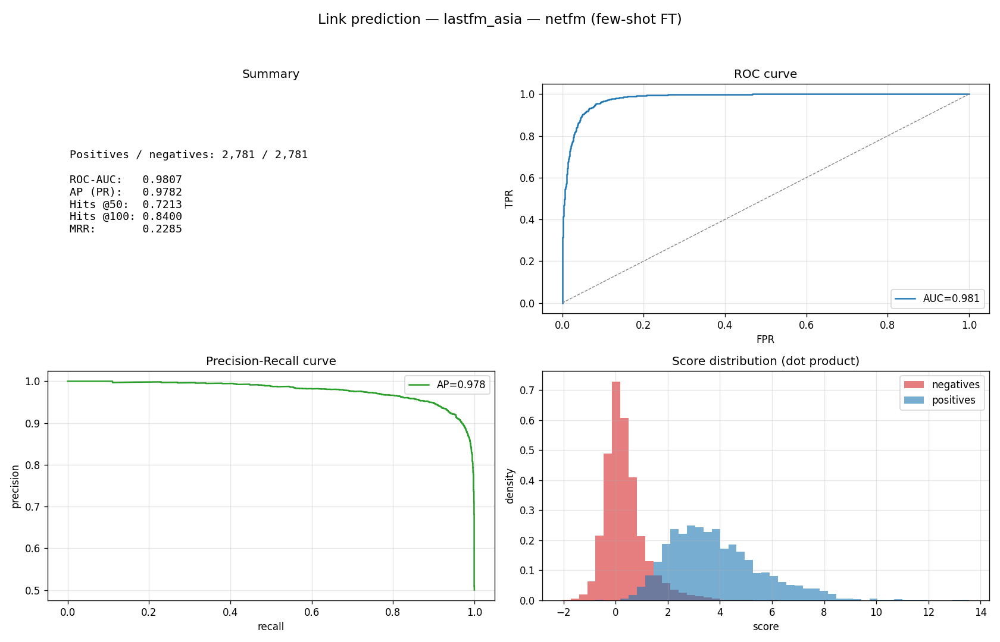
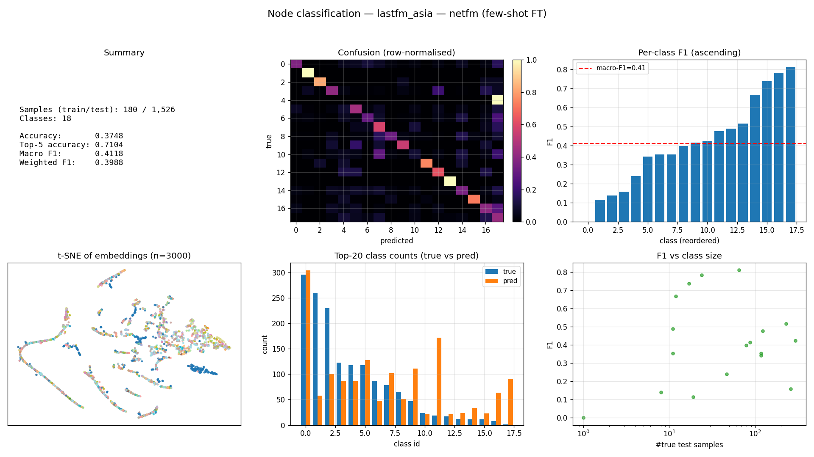
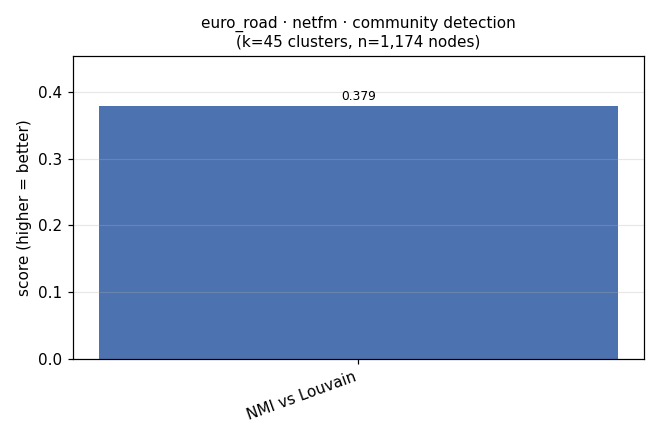
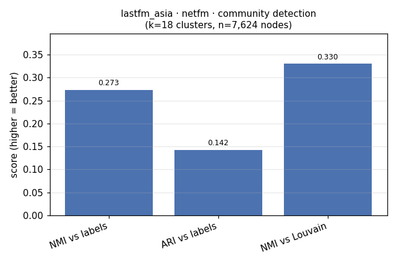

# NetFM — A Graph Foundation Model

**NetFM** is a single GNN encoder, pre-trained once on ten diverse networks, that
transfers to new graphs and new tasks **without per-graph retraining**. One
checkpoint, many downstream uses: link prediction, community detection, and
node classification on held-out graphs spanning social, citation, biological,
infrastructure and collaboration domains.

---

## Table of contents

1. [Highlights](#highlights)
2. [Motivation](#motivation)
3. [Architecture](#architecture)
4. [Pre-training corpus](#pre-training-corpus)
5. [Evaluation protocol](#evaluation-protocol)
6. [Results](#results)
7. [Interactive visualizer](#interactive-visualizer)
8. [Quickstart](#quickstart)
9. [Repository layout](#repository-layout)
10. [Acknowledgments](#acknowledgments)

---

## Highlights

- **One pre-trained encoder, five held-out graphs, three downstream tasks.**
  No per-graph retraining on the GFM side.
- **Beats a fully-supervised GCN** on link prediction for `euro_road` (AUC
  0.988 vs 0.751) and `lastfm_asia` (AUC 0.980 vs 0.874) with only 10 labelled
  edges per class fine-tuning.
- **Cleanest cross-domain community win** on the unlabelled `euro_road` road
  network: NetFM's k-means partition agrees with Louvain at NMI = 0.38, more
  than **2× a target-trained node2vec**.
- **Domain-agnostic by construction.** Dual structural (6-dim) + spectral SVD
  (256-dim) input with a learnable mix gate, plus a 3-number graph context
  vector, so the model never depends on dataset-specific features.
- **Fully reproducible.** Every result in this README has a `results.csv`
  under `outputs/testing/` and a SLURM submission script in the repo root.
- **Ships with a native Qt visualizer** (PySide6 + pyqtgraph) for exploring
  embeddings, communities, and NetFM predictions in 2D / 3D.

---

## Motivation

Foundation models reshaped NLP and vision: pre-train once on a broad corpus,
then apply to any downstream task with little or no extra data. NetFM asks
the same question for graphs:

> *Can a single GNN, pre-trained on many unrelated networks, produce useful
> embeddings for unseen graphs across unseen domains and unseen tasks?*

Most GNN literature trains **one model per graph**. That is fine when labels
are abundant, but it does not scale, does not transfer, and does not match
how foundation models are used elsewhere. NetFM is an end-to-end attempt at a
transferable, domain-agnostic graph encoder, with a pre-training corpus that
deliberately spans five semantic domains.

---

## Architecture

See `src/model.py`.

**Inputs** (both domain-agnostic — no text, no molecular features, no user
metadata is ever fed in):

- **Structural channel (6-dim).** Degree, clustering coefficient, PageRank,
  triangle count, k-core, eigenvector centrality. Computed once per graph and
  cached under `figures/data/`.
- **Spectral channel (256-dim).** Truncated SVD of the (signed) adjacency
  matrix — captures the global low-rank structure that the local 6-feature
  vector cannot see.

**Fusion.** A learnable scalar `α = σ(mix)` mixes the two channels, added to a
3-number graph context vector `graph_proj([log N, log E, log avg_deg])` so the
encoder knows the scale of the current graph:

```
h₀ = α · MLP_struct(x_struct)
   + (1 − α) · MLP_svd(x_svd)
   + graph_proj([log N, log E, log avg_deg])
```

**Encoder.** 3-layer GraphSAGE, hidden dim 256, BatchNorm + ReLU + dropout 0.1.

**Self-supervised heads** (see `src/pretrain.py`) — combined via Kendall
uncertainty weighting `L = Σ ½·exp(-2sᵢ)·Lᵢ + sᵢ`:

1. **Masked feature reconstruction** — mask 15 % of input rows, reconstruct
   both structural and SVD targets. MSE.
2. **Link prediction** — hide 10 % of edges, score held-out vs. random
   negatives by dot product. BCE.
3. **Subgraph property regression** — predict local clustering + triangle
   count from the final embedding. MSE.

Training curves for the final checkpoint (loss, per-head uncertainty weights,
and the learned α gate) are included at `report/images/training_metrics.png`.

---

## Pre-training corpus

10 graphs across 5 domains, ~30 minutes on a single RTX 3090, 100 epochs ×
200 steps per epoch.

| Domain         | Graphs                                |
|----------------|----------------------------------------|
| Citation       | Cora, CiteSeer, PubMed                 |
| Biological     | PPI                                    |
| Social         | Facebook-ego, Twitch-EN                |
| Collaboration  | Coauthor-CS, DBLP-SNAP                 |
| Infrastructure | Power-Grid, AS-733                     |

Checkpoint: `outputs/training/20260419_004517_v1/encoder.pt`.

---

## Evaluation protocol

Five **held-out** graphs the encoder never saw during pre-training:

| Graph          | Domain          | Nodes   | Edges       | Labels         |
|----------------|-----------------|---------|-------------|----------------|
| `lastfm_asia`  | social          | 7,624   | 55,612      | 18 classes     |
| `ogbn-arxiv`   | citation        | 169,343 | 2,315,598   | 40 classes     |
| `ogbn-proteins`| biological      | 132,534 | 79,122,504  | multi-label    |
| `euro_road`    | infrastructure  | 1,174   | 2,834       | *(unlabelled)* |
| `ogbn-mag`     | collaboration   | 736,389 | 10,792,672  | 349 classes    |

Three **downstream tasks**:

1. **Node classification** — accuracy, top-5 accuracy, macro-F1, weighted-F1.
2. **Link prediction** — AUC, AP, Hits@50, Hits@100, MRR (10 % edge hold-out,
   matched random negatives).
3. **Community detection** — k-means on frozen embeddings with `k` = number
   of true classes (or number of Louvain communities when no labels exist),
   scored against ground-truth labels (NMI, ARI) and against a Louvain
   partition of the same graph (NMI).

Three **settings** for NC and LP:

- **Zero-shot** — freeze the encoder, train only a linear head.
- **10-shot fine-tune** — fine-tune the encoder + a small head on K = 10
  labels per class (or a matching edge budget for LP).
- **Supervised (upper bound)** — train a fresh 3-layer GCN end-to-end on the
  full training split; serves as the reference number a good GFM should chase.

Five **baselines**: `random`, `structural`, `svd`, `node2vec`, `supervised_gcn`.

---

## Results

### Training dynamics



Loss curves converge smoothly, the α mix-gate settles at a non-degenerate
value (both channels contribute), and Kendall uncertainty weights redistribute
credit across the three SSL heads as training progresses.

### Aggregate leaderboard



Raw numbers: `outputs/testing/final_leaderboard.txt`.

### 1. Link prediction (AUC, higher is better)

| Dataset        | Best method (setting)           | AUC        | Supervised GCN |
|----------------|---------------------------------|------------|----------------|
| `euro_road`    | **NetFM (10-shot)**             | **0.988**  | 0.751          |
| `lastfm_asia`  | **NetFM (10-shot)**             | **0.980**  | 0.874          |
| `ogbn-arxiv`   | node2vec (zero-shot)            | 0.998      | 0.966          |
| `ogbn-arxiv`   | — NetFM (10-shot, #2)           | 0.992      | —              |
| `ogbn-mag`     | node2vec                        | 0.999      | not run        |
| `ogbn-proteins`| node2vec                        | 0.977      | not run        |

10-shot NetFM is the best method on the two smallest / medium graphs and
**beats a fully-supervised GCN trained from scratch** on both — the core GFM
hypothesis holds for LP. On giant OGB graphs, target-trained node2vec still
wins: LP there is dominated by local connectivity that node2vec memorises
directly.

Example per-dataset plots:

<p align="center">
  
  
</p>

### 2. Node classification (accuracy, higher is better)

| Dataset        | Best zero-shot        | Best 10-shot          | Supervised GCN |
|----------------|-----------------------|-----------------------|----------------|
| `lastfm_asia`  | node2vec (0.747)      | node2vec (0.385)      | **0.686**      |
| `ogbn-arxiv`   | node2vec (0.659)      | node2vec (0.445)      | **0.697**      |
| `ogbn-mag`     | node2vec (0.308)      | node2vec (0.125)      | not run        |

Zero-shot NetFM beats `random`, `structural`, and `svd` baselines by wide
margins but does not overtake target-trained node2vec on NC. This is expected:
class labels often depend on domain-specific semantic signal (word embeddings,
molecular features) that our structural-only input deliberately discards.



### 3. Community detection

k-means on frozen embeddings, `k` = number of true classes (or number of
Louvain communities where no labels exist). NMI vs. ground-truth labels where
available; NMI vs. a Louvain partition of the same graph otherwise.

| Dataset       | Method     | NMI vs. labels | NMI vs. Louvain |
|---------------|------------|----------------|-----------------|
| `lastfm_asia` | random     | 0.007          | 0.011           |
| `lastfm_asia` | structural | 0.060          | 0.063           |
| `lastfm_asia` | svd        | 0.000          | 0.000           |
| `lastfm_asia` | **NetFM**  | 0.273          | 0.330           |
| `lastfm_asia` | **node2vec** | **0.487**    | **0.547**       |
| `euro_road`   | random     | —              | 0.161           |
| `euro_road`   | structural | —              | 0.292           |
| `euro_road`   | svd        | —              | 0.000           |
| `euro_road`   | **NetFM**  | —              | **0.379**       |
| `euro_road`   | node2vec   | —              | 0.168           |
| `ogbn-arxiv`  | random     | 0.001          | —               |
| `ogbn-arxiv`  | structural | 0.088          | —               |
| `ogbn-arxiv`  | svd        | 0.221          | —               |
| `ogbn-arxiv`  | **NetFM**  | 0.225          | —               |
| `ogbn-arxiv`  | **node2vec** | **0.387**    | —               |

On the unlabelled `euro_road` infrastructure graph, **NetFM's clustering
agrees with Louvain best (NMI = 0.379, > 2× node2vec)** — the cleanest
cross-domain community result: no labels, pure structure, cross-domain
pre-training beats a target-trained baseline.

<p align="center">
  
  
</p>

A full plain-English analysis of all results is in
[`outputs/results_summary.md`](outputs/results_summary.md). Raw CSVs live
under `outputs/testing/<timestamp>/results.csv`.

---

## Interactive visualizer

A native Qt dashboard (PySide6 + pyqtgraph) is shipped under `src/visualize.py`
for interactively exploring graphs, embeddings, and NetFM's predictions in
2D / 3D. It has **two tabs**:

### Tab 1 — Graph Visualization

Pick any dataset (or load your own edge list), choose a layout
(`spring`, `kamada_kawai`, `spectral`, `circular`, `community`) in 2D or 3D,
choose a sampling strategy (`ego`, `random_walk`, `community`) for large
graphs, and render. The dashboard shows:

- Node / edge counts, density, average degree, clustering, diameter proxy
  (right-hand Statistics tab).
- Community assignments (Louvain) with dataset-aware class names
  (e.g. *cluster 3 · Neural_Networks (72 %)* on Cora).
- Hover-selected node info and expandable neighbourhood in the Selected tab.
- Intra-community vs. cross-community edges coloured differently to make
  structure visible at a glance.

### Tab 2 — Model Testing

Load the pre-trained NetFM checkpoint and run a task **live on the chosen
graph** — supported tasks are node classification and link prediction. The
panel shows per-node predicted-vs-true labels, confidence, and error
highlights directly on the layout; a frame slider walks through training
epochs when a fine-tune is selected.

### Launching the visualizer

```bash
# install visualizer extras (PySide6, pyqtgraph, python-louvain, PyOpenGL)
pip install -e .[viz]

# open the dashboard
python -m src.visualize

# skip the splash — render a specific dataset in 3D immediately
python -m src.visualize --dataset lastfm_asia --dim 3 --layout community

# go straight to the model-testing tab
python -m src.visualize --mode testing --dataset euro_road
```

CLI options:

| Flag         | Values                                              | Default   |
|--------------|-----------------------------------------------------|-----------|
| `--dataset`  | any registered dataset name (`cora`, `lastfm_asia`, …) | *off*     |
| `--dim`      | `2`, `3`                                            | `3`       |
| `--layout`   | `spring`, `kamada_kawai`, `spectral`, `circular`, `community` | `spring` |
| `--sample`   | `ego`, `random_walk`, `community`                   | `ego`     |
| `--size`     | number of sampled nodes for large graphs            | `2000`    |
| `--mode`     | `graph`, `testing`                                  | `graph`   |

Layout caches are written to `figures/layouts/` and reused across runs, so
large graphs are only laid out once.

---

## Quickstart

```bash
# 1. Create a fresh environment and install
python -m venv .venv
source .venv/bin/activate
pip install -e .

# 2. Build structural + SVD features once per dataset
sbatch features.slurm     # or: python -m src.features

# 3. Pre-train NetFM (≈ 30 min on one RTX 3090)
sbatch pretrain.slurm --run-name v1

# 4. Evaluate — one SLURM submission per setting
CKPT=outputs/training/<run_id>/encoder.pt

sbatch eval.slurm --checkpoint $CKPT --setting zero_shot  --run-name v1_zero
sbatch eval.slurm --checkpoint $CKPT --setting few_shot   --run-name v1_fewshot --k-per-class 10
sbatch eval.slurm --checkpoint $CKPT --setting supervised --run-name v1_supervised

# 5. Community detection
sbatch eval_community.slurm \
    --checkpoint $CKPT \
    --datasets lastfm_asia,ogbn_arxiv,euro_road \
    --run-name community_final

# 6. Aggregate results into one plot + leaderboard
python -m src.plot_eval \
    --runs outputs/testing/*_v1* \
    --out outputs/testing/final_comparison.png \
    --leaderboard outputs/testing/final_leaderboard.txt
```

Everything outside SLURM works equally well under plain `python -m …` on a
local workstation; the `.slurm` wrappers just hand off the same command to a
cluster.

---

## Repository layout

```
NetFM/
├── src/
│   ├── model.py           # dual-channel GraphSAGE encoder + graph context
│   ├── pretrain.py        # 3-head SSL, Kendall uncertainty weighting
│   ├── evaluate.py        # zero-shot / 10-shot / supervised — LP + NC
│   ├── eval_community.py  # k-means + Louvain community detection
│   ├── baselines.py       # random / structural / svd / node2vec / GCN
│   ├── finetune.py        # shared few-shot / supervised fine-tune loop
│   ├── features.py        # 6-dim structural + 256-dim SVD pre-compute
│   ├── data.py            # unified dataset loader (OGB + SNAP + PyG)
│   ├── tasks.py           # task-specific heads and scorers
│   ├── plot_eval.py       # aggregate leaderboard + bar-chart grid
│   └── visualize.py       # PySide6 / pyqtgraph Graph Explorer
├── pretrain.slurm
├── eval.slurm
├── eval_community.slurm
├── features.slurm
├── outputs/
│   ├── training/<run>/    # encoder.pt, training_metrics.png, metrics.csv
│   ├── testing/<run>/     # results.csv + plots/ per evaluation run
│   ├── results_summary.md # plain-language write-up of every result
│   └── testing/final_*    # aggregated leaderboard and comparison plots
└── figures/
    ├── data/              # cached structural + SVD features per dataset
    └── layouts/           # cached 2D/3D coordinates for the visualizer
```

---

## Acknowledgments

Built on top of PyTorch Geometric, the Open Graph Benchmark, SNAP, and
NetworkX for datasets and tooling.

*License: MIT (see `pyproject.toml`).*
